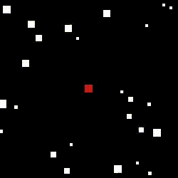
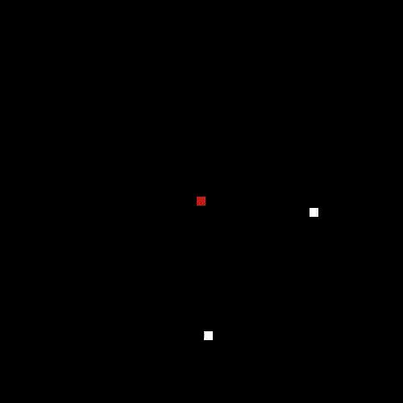

## basic n-body simulation in julia

This is a weekend exercise to implement n-body collision + gravity interactions. The real goal was to gain experience using Julia.

In the sample video we have balls, confusingly shown as squares, with sizes that also reflect their mass. Each white ball starts off with initial positions and some `x,y` velocity.
The red square is shown at the position of the uniform gravity source, which we have move around the world randomly throughout the run.
I'd see small balls fly around very quickly, somewhat detracting from the viewing expericence. So, I threw in a quirk that collisions with the world border will also rob the ball of 10% of its velocity.

-----

Features:
- Collision detection with "balls" of varying masses and radii
- Simplified visualization drawing squares intead of balls
- Outputs a video file of the simulation run
- Point source constant gravity field

These core things are still missing:
- [ ] gravity for all particles (+ gravity that depends on distance from the mass) <-- this really seems like the most important thing left hanging
- [ ] multiple gravity sources
- [ ] multi-threading collision detection, updating, and drawing <-- I feel like this would be really cool and probably enable really big N's
- [ ] real simultaneous time-stepping <-- currently balls are updated one at a time

These things would be nice:
- [ ] better visualization including really circles, a live display, and visualizing gravity fields
- [ ] a history line, or short tail for each ball
- [ ] command line arguments 
- [ ] colored balls

-----
## A few more videos

<!--  -->
100 balls, random initial velocity

100 balls, initial velocity orthogonal to acceleration due to gravity

